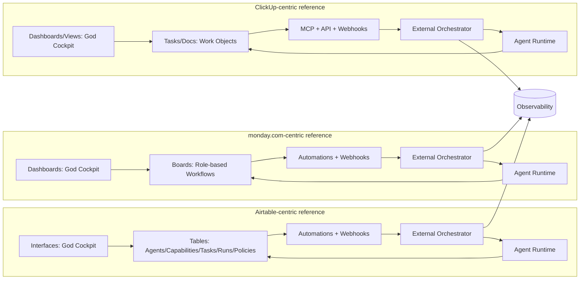
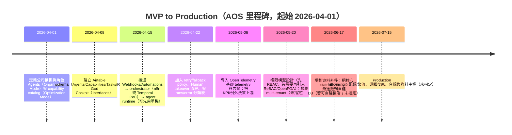

# AI‑First 一人/零人數位公司 Agent Operating System（AOS）參考系統評估：Airtable vs monday.com vs ClickUp（截至 2026-04-01）

[下載 research.md](sandbox:/mnt/data/research.md)

## Executive Summary
本報告以「一人/零人數位公司」為核心情境：人類使用者從 Day 1 起即以 God 視角治理多個 AI Agents，常態只看高層 Dashboard、遇到例外才真人 takeover。三款候選工具各自代表不同「世界觀」：**Airtable 更像資料/狀態骨架（data/state backbone）**、**monday.com 更像角色/流程駕駛艙（role/workflow cockpit）**、**ClickUp 更像任務/工作物件樞紐（task/work‑object hub）**。綜合資料模型、事件驅動整合、治理與 agent‑first 能力，本報告的**單一參考系統首選是 Airtable**；若你把「職場擬人化 + Day‑1 老闆感」視為第一優先，monday.com 的 cockpit/角色敘事最值得抄；若你把「agent 直接操控工作物件」視為第一優先，ClickUp 的 MCP/AI 介面是最強參考。最終建議採 **Role‑framed（外觀）× Capability‑powered（執行）× State‑orchestrated（編排）** 的分層架構，並用外部 orchestrator/queue/observability 補齊三者在可靠重試、長流程與可觀測性上的原生缺口。 citeturn3search12turn0search17turn0search2turn4search22turn4search4

本報告評估對象為 entity["company","Airtable","collaboration platform"]、entity["company","monday.com","work management platform"] 與 entity["company","ClickUp","productivity platform"]；優先採用官方支援/開發者文件與 2024–2026 更新條目作為依據（例如 Webhooks/AI/權限/審計/定價與限制）。 citeturn0search0turn0search13turn0search6turn1search0turn1search1turn1search2

## 前提與假設
**已指定的目標使用情境**
- **使用者角色**：單一人類（God/Owner/Governor），不參與日常協作；主要互動是「高層戰情室」與「例外決策/接管」。
- **執行者**：多個 AI Agents（A2A 自動協作為主），可依職場文化擬人化成 RD/PM/Growth/Sales/CS/Finance/HR 等角色（以降低理解成本）。
- **業務範圍**：以「軟體研發與上架」為核心，但希望同一套治理視角可延伸到銷售、行銷、人資、客戶關係、營運、財務等。

**未指定的關鍵參數（本報告將標註為「未指定」並以合理假設評估）**
- **預算**（未指定）：可接受的月費上限；偏好 seat‑based、bucket pricing、或 credit‑based（AI credits/usage）計費。 citeturn1search0turn1search1turn1search2  
- **使用者技術能力**（未指定）：是否具備資料建模、API/automation、DevOps、自架服務能力。 citeturn4search8  
- **是否可自建後端**（未指定）：是否允許自建 DB、queue、orchestrator、observability。 citeturn4search22turn4search8turn4search4  
- **期望上線時間**（未指定）：MVP 上線目標（例如 2 週/1 月/1 季）。  
- **使用者數量**（未指定）：除 God 外是否會有少量真人（外包/會計/法務/客戶）登入；AI agents 是否必須有「獨立身份」與權限。 citeturn2search15turn2search13turn2search2  
- **合規/資料主權需求**（未指定）：是否需要 SSO/SCIM、audit log 保留、data residency、multi‑tenant 隔離。 citeturn2search3turn2search19turn2search1turn1search14turn0search1  

**評分方法（0–10）**
- 10：原生能力大幅覆蓋 AOS 需求（少量外掛即可）。
- 7–9：可滿足核心，但需外部元件補強可靠性/可觀測性/治理。
- 4–6：更像「參考/局部核心」；若要像 AOS 必須外部系統大幅補齊。
- 0–3：與 AOS 世界觀高度不匹配。  

## 總結評分與排名
**總分表（滿分 100）**  
（分數對應下節十個維度；總分採等權重加總）

| 維度 | Airtable | monday.com | ClickUp |
|---|---:|---:|---:|
| 資料模型彈性 | 9 | 6 | 7 |
| workflow / orchestration | 6 | 5 | 5 |
| agent-first 支援 | 7 | 8 | 9 |
| API / automation / webhook | 9 | 8 | 8 |
| 權限與治理 | 8 | 8 | 7 |
| observability 與 metrics | 5 | 5 | 5 |
| 可擴展性與成本估算 | 7 | 5 | 6 |
| 上手難度與可配置性 | 7 | 9 | 7 |
| AI/LLM 原生整合 | 8 | 8 | 9 |
| 生態系與第三方工具 | 9 | 8 | 8 |
| **總分** | **75** | **70** | **71** |
| **排名** | **1** | **3** | **2** |

分數反映的是「拿它當 AOS 參考系統」的整體貼合度，而非一般專案管理工具評比。尤其在你指定的 God‑mode/背景 A2A 場景中，**資料與狀態**（可承載多 agent 的 ontology/state machine）通常比「協作 UI 的漂亮程度」更決定成敗。 citeturn3search12turn0search0turn0search17turn0search2

## 十個維度逐項評估
以下每個維度都包含：**簡短評語、量化評分（0–10）、關鍵風險與限制、適用情境建議**。為符合「一人 God + 多 agent 背景運作」前提，建議用法會特別標註各工具在 AOS 中最合理的分工位置。

**維度一：資料模型彈性（relational schema、transactional state）**  
Airtable 的核心優勢是多表與 linked records（類關聯/外鍵概念）可直接建模「Agents / Capabilities / Tasks / Runs / Policies / Assets」等多實體狀態。 citeturn3search12turn3search4turn3search8  
monday.com 與 ClickUp 也有關聯能力（Connect boards、Relationships），但更偏向「把工作物件互相連起來」，而非把整公司系統當資料庫設計。 citeturn3search5turn3search6  

| 工具 | 分數 | 簡短評語 | 關鍵風險與限制 | 適用情境建議 |
|---|---:|---|---|---|
| Airtable | 9 | 多表 + linked records 近似關聯式建模，適合做 AOS state backbone。 | 非傳統 RDBMS；高併發/強一致交易仍需外部 DB。 | 把 agent、任務、執行紀錄全部落在 records；用 Interfaces 做 God cockpit。 |
| monday.com | 6 | 以 board item 為核心，靠 Connect boards/Mirror 做跨板關聯。 | 關聯彈性與可維護性不如多表關聯；多板同步成本高。 | 適合「部門/流程視覺化」，不宜作為唯一 source‑of‑truth。 |
| ClickUp | 7 | tasks + relationships/dependencies 強，適合做研發與交付工作物件宇宙。 | 天生偏 task universe；承載 CRM/財務等本體資料較彆扭。 | 把 spec/issue/doc/交付物集中於此；公司治理資料建議外移到資料層。 |

**維度二：workflow/orchestration 能力（state machine、retry、fallback、依賴管理）**  
三者都提供內建 automations，但它們多數屬於「事件觸發 → 動作」的工作流，並非耐久型狀態機（durable state machine）；若你要真正的 retry/fallback/補償交易與長流程，往往需要外部 orchestrator（例如 Temporal 的 durable execution / 內建 retries、timers、queues）。 citeturn3search1turn3search29turn4search22turn4search3  

| 工具 | 分數 | 簡短評語 | 關鍵風險與限制 | 適用情境建議 |
|---|---:|---|---|---|
| Airtable | 6 | Automations +「Run a script」可做背景步驟；有 run history 可追查用量/歷史。 | 原生條件分支與自動 retry 能力有限；複雜補償流程不友善。 | 當「觸發器 + 狀態表」；可靠編排交給外部 orchestrator。 |
| monday.com | 5 | Automations 上手快；Dependencies/Connect boards 易做基本流程。 | 複雜 state machine、長交易、可靠重試仍要外移。 | 把它當「可視化流程層」；真正 A2A 編排外移。 |
| ClickUp | 5 | Dependencies/Relationships + API 使得 agent 可把工作拆解與依賴管理落在 tasks 上。 | 仍非耐久型 orchestrator；可靠重試/rollback 需外部補。 | 負責「工作物件協調與依賴表示」；執行編排外移。 |

**維度三：agent-first 支援（agent 作為一等公民的建模與執行介面）**  
monday.com 在 2026 的官方公告中，明確提出 AI Agents 可 free sign‑up、即時取得 API key、並支援 MCP（Model Context Protocol），把「agent 作為平台內的參與方」這件事往前推了一大步。 citeturn0search17  
ClickUp 也在開發者文件中提供官方 MCP Server，定義 MCP 為安全標準化框架，讓外部 AI agents 用自然語言/工具化方式存取 ClickUp workspace 物件（tasks/lists/docs 等）。 citeturn0search2turn0search6  
Airtable 的「agent」更偏向資料層內嵌（Field agents 在 cell level 自動擷取/分析/生成資料），非常適合背景運作，但「agent 身份生命週期」語意通常要你自己建模。 citeturn0search4  

| 工具 | 分數 | 簡短評語 | 關鍵風險與限制 | 適用情境建議 |
|---|---:|---|---|---|
| Airtable | 7 | AI 能嵌入欄位/records，適合「背景自動化公司」。 | agent 身份、delegation policy、多 agent 權限語意多需自建。 | 把 agent registry、capability、runs 都建成表；外部 runtime 執行。 |
| monday.com | 8 | 官方把 AI agent 納入平台運作（signup/API key/MCP），最像「數位員工」進公司。 | 仍偏人類組織語境；agent 計費/權限細節需慎讀方案。 | 當你主打「職場角色擬人化」與 Day‑1 老闆感，最值得抄 UI/敘事。 |
| ClickUp | 9 | 官方 MCP Server 讓 agent 存取 tasks/docs 等 work objects，介面清晰。 | agent‑first 強點集中在 ClickUp 物件世界；跨治理資料仍需外部層。 | 把它視作「agent 操作工作物件」的標準參考與整合入口。 |

**維度四：API / automation / webhook 生態（雙向整合、事件驅動能力）**  
Airtable 提供 Webhooks API 以即時通知 base 變更（record 新增/欄位更新/view 變動相關）。 citeturn0search0turn0search8  
monday.com 的 Platform API 為 GraphQL，並在 webhooks 文件中描述 webhook URL verification 與 retry policies，對事件驅動整合很關鍵。 citeturn0search13turn0search5  
ClickUp 的 developer portal 也同時列出 Public API、Webhooks、OAuth 與 MCP。 citeturn0search6  

| 工具 | 分數 | 簡短評語 | 關鍵風險與限制 | 適用情境建議 |
|---|---:|---|---|---|
| Airtable | 9 | webhooks + API 能把 Airtable 變成事件來源與狀態存放層。 | 大量事件需節流/去重/一致性；可能要 replication/queue。 | 以 webhooks 驅動外部 orchestrator；Airtable 記錄 state。 |
| monday.com | 8 | GraphQL 取得資料彈性高；webhooks 有 verification/retry 的平台級支援。 | 多產品線/多物件 schema 較複雜；權限與 token 管理需嚴謹。 | 以平台事件驅動「部門 workflows」；外部 runtime 負責執行。 |
| ClickUp | 8 | API + webhooks + OAuth + MCP 完整，最適合把 agent 拉進系統。 | 對非 task 的治理資料仍需外部層；API limits/plan 綁定需確認。 | 用 MCP/API 讓 agent 讀寫 tasks/docs；外部 DB 記錄商業狀態。 |

**維度五：權限與治理（RBAC、audit log、multi-tenant）**  
Airtable 的 enterprise permissions 描述多種管理角色（如 Super Admin / Org Unit Admin / Integration Admin 等），並且有 audit logs（含 API）與 data residency（Enterprise Scale 可選區域）。 citeturn2search15turn1search7turn2search3turn1search3  
monday.com 的 permissions 文件指出可依 user type（admin/member/viewer/guest）控制建立 boards/docs、邀請、匯出、API token、automations 等行為；同時有 custom roles 與 SCIM provisioning。 citeturn2search13turn2search5turn2search1  
ClickUp 提供 custom role permissions 的管理頁，audit logs 於 Enterprise 方案並有保留期限制（文件示例為 30 天）。 citeturn2search2turn1search14turn1search38turn1search6  

| 工具 | 分數 | 簡短評語 | 關鍵風險與限制 | 適用情境建議 |
|---|---:|---|---|---|
| Airtable | 8 | enterprise 治理語意完整（roles、SSO/SCIM、audit logs、data residency）。 | 多數進階治理在 Enterprise 才完整；MVP 期可先簡化。 | 你若預期未來 multi‑tenant/合規，Airtable 的治理模型很能借鏡。 |
| monday.com | 8 | 權限中心與 custom roles 對「公司治理感」非常直覺。 | advanced security 多在 Enterprise；default 成本可能偏高。 | 你若優先「像在管理公司」，monday 的 governance UX 值得抄。 |
| ClickUp | 7 | custom roles 細緻；audit logs/監控偏 Enterprise。 | audit logs 保留期限制；要合規通常得 Enterprise。 | 適合需要把少量真人與外包拉進來但又要控權限的情境。 |

**維度六：observability 與 metrics（logs、runs、performance）**  
Airtable 可在「Managing automations」看到 run history/usage；monday 與 ClickUp 主要以 audit logs/活動記錄輔助審計，但三者都不是完整 observability 平台。 citeturn3search11turn0search21turn1search38turn1search14  
若 AOS 要支撐大量 A2A 執行，你通常需要導入 OpenTelemetry 這類標準化 telemetry（traces/metrics/logs）才能長期營運。 citeturn4search4turn4search16turn4search1  

| 工具 | 分數 | 簡短評語 | 關鍵風險與限制 | 適用情境建議 |
|---|---:|---|---|---|
| Airtable | 5 | 有 automation run history 與 audit logs，但缺 run‑level trace/metrics。 | A2A 大量執行的性能/失敗分佈需外部觀測。 | 讓 Airtable 記錄 KPI 與狀態；詳細觀測交給 OTel/Grafana/Datadog。 |
| monday.com | 5 | dashboards + audit logs 適合作「老闆看全局」與審計。 | 不適合當 debug pipeline 的觀測核心。 | 把它當 cockpit；把 run/perf 交給外部。 |
| ClickUp | 5 | enterprise audit logs 可做合規參考；活動資訊可輔助追查。 | 與完整 observability stack 仍有距離。 | 讓 ClickUp 聚焦工作物件；執行觀測外移。 |

**維度七：可擴展性與成本估算（MVP → 自建 DB 遷移難度，含假設）**  
**成本假設（未指定但為便於比較採用）**：人類付費使用者 1 人；AI agents 多用 API 存取、不額外佔 seat；MVP 期不購買 Enterprise；每日 100–1000 次工作流執行量級。  
Airtable 定價頁顯示 Team/Business 等方案以 seat 計費；另外也有「collaborators impact billing」條目說明不同角色是否計費。 citeturn1search0turn1search32turn1search4  
monday.com 支援文件描述 bucket pricing，付費方案從至少 3 seats 起並以座位數 bucket 增長。 citeturn1search1turn1search25  
ClickUp 定價頁指出 AI Super Credits 為 pay‑as‑you‑go、可用於 Super Agents/AI Fields/AI Automations 等。 citeturn1search2  

| 工具 | 分數 | 簡短評語 | 關鍵風險與限制 | 適用情境建議 |
|---|---:|---|---|---|
| Airtable | 7 | 對 AOS MVP 很友善：資料/狀態先落地，日後搬到自建 DB 也相對順。 | record/automation/AI credits 可能變瓶頸；需規劃抽換到 DB。 | 「先快後穩」：Airtable 做 state store → 逐步外移核心表到 Postgres。 |
| monday.com | 5 | bucket pricing 對 default 不利；但 cockpit 成熟。 | 成本與資料模型使得長期當唯一本體層較難。 | 當你把「快速像公司」擺第一，且可接受座位成本。 |
| ClickUp | 6 | 以 tasks 為核心的 MVP 成本通常可控；AI 另以 credits 管理。 | 遷移到 DB 時需重新定義非任務類本體資料。 | 研發/交付先跑起來，会社治理資料逐步外移到資料層。 |

**維度八：上手難度與 business-user 可配置性**  
monday.com 的 board + automations 對職場使用者直覺，且官方在 permissions/automations 等文件中以「讓 boards 自動跑」作為主要敘事。 citeturn3search29turn2search13  
Airtable 需要一定資料建模概念，但官方也有一系列「create your database / linked records」的引導，並可用 Interfaces 做可視化介面。 citeturn3search31turn3search12  
ClickUp 則功能廣且深，適合熟悉任務管理的人，但容易把使用者拉回 drill‑down 的 task 管理心智。 citeturn3search6turn3search10  

| 工具 | 分數 | 簡短評語 | 關鍵風險與限制 | 適用情境建議 |
|---|---:|---|---|---|
| Airtable | 7 | 學會資料建模後回報很高；更適合把公司當「資料/狀態機」。 | 不懂 relational/資料治理會失控；需模板化。 | 你若要「公司由 state machine 運作」，Airtable 是最好的心智訓練場。 |
| monday.com | 9 | 最快讓職場人進入「我在管部門」的 God 感。 | 易誘發 drill‑down；需你設計「老板模式」限制細節噪音。 | 以 adoption/體驗為先的產品，monday 值得大量參考 UI/敘事。 |
| ClickUp | 7 | 對研發/PM 熟悉、工具箱完整。 | 選項多且 task-centric；不利「背景 A2A」的低干預體驗。 | 把它定位成「研發/交付層」而非全公司 cockpit。 |

**維度九：AI/LLM 原生整合（內建 AI、plugin、市場）**  
Airtable 支援「Airtable AI in fields」，文件提到 Field agents 可在 cell level 自動擷取、分析與生成資料（甚至可從 web/文件取得資訊，需留意資料治理）。 citeturn0search4  
monday.com 2026 的官方公告把 AI agents 納入平台並提 MCP 支援。 citeturn0search17  
ClickUp 定價頁直接把 AI Super Credits 套用到 Super Agents/AI Fields/AI Automations 等，且有官方 MCP server 文件。 citeturn1search2turn0search2  

| 工具 | 分數 | 簡短評語 | 關鍵風險與限制 | 適用情境建議 |
|---|---:|---|---|---|
| Airtable | 8 | AI 深度嵌入資料層（field agents），適合大規模資料 enrichment/摘要/分類。 | AI credits 與 plan 綁定；bring‑your‑own‑model 仍多靠外部。 | 把 AI 放在資料入口與治理流程（例如 lead enrichment、文件抽取）。 |
| monday.com | 8 | AI agents 平台化，適合把 agent 當「平台內員工」。 | 仍偏 work management 語境；純 A2A 背景編排需外部。 | 你若要「agents 在同一 cockpit 被治理」，monday 值得抄。 |
| ClickUp | 9 | MCP + AI credits 結構清楚，最利於打造 agent‑controlled work hub。 | credits 成本與濫用需控管；資料聚焦在 ClickUp 物件世界。 | 適合作為「自然語言控制任務宇宙」的主要參考。 |

**維度十：生態系與第三方工具（n8n、Zapier、Make、FaaS、DB connectors）**  
Airtable 與 Zapier/Make/n8n 的整合頁面與官方教學相對齊全：例如 Zapier 的 Airtable integrations 頁、Airtable 官方的 Zapier 指南、Make 的 Airtable integrations 頁，以及 n8n 的 Airtable node 文件。 citeturn5search1turn5search2turn5search0turn5search4  
ClickUp 也有 n8n node 與 integrations 頁；monday.com 同樣可與 n8n 透過 webhook/節點整合。 citeturn5search3turn5search5turn0search37  

| 工具 | 分數 | 簡短評語 | 關鍵風險與限制 | 適用情境建議 |
|---|---:|---|---|---|
| Airtable | 9 | 最像「中心資料層」：各種自動化工具都容易圍著它轉。 | 整合規模大時需做去重、節流、對帳與一致性策略。 | 把 Airtable 當 hub，再用 n8n/Make/Zapier 擴展。 |
| monday.com | 8 | 整合成熟；特別適合把「部門板」接進自動化管線。 | 多產品線/多 workspace 時整合與權限會變複雜。 | 當 cockpit/協作層；外部工具串接跨系統工作。 |
| ClickUp | 8 | 對 tasks/docs 的整合點多；MCP 生態正在形成。 | 需釐清哪些資料留 ClickUp、哪些落 DB；否則會碎片化。 | 把 ClickUp 當 work‑object hub，外部 orchestrator 負責跨域。 |

## 建議、MVP 架構與必要補強元件
**結論（針對你的「God 模式」前提）**
- **首選參考系統：Airtable（抄「腦」）**  
  因為它最自然承載「公司是一個資料/狀態機」：linked records 的資料建模、webhooks 事件驅動、automations（含 background script action）與 enterprise audit/permissions 的治理語意，都非常貼近 AOS 的 source‑of‑truth 需求。 (https://support.airtable.com/docs/understanding-linked-record-relationships-in-airtable) (https://www.airtable.com/developers/web/guides/webhooks-api) (https://support.airtable.com/docs/run-a-script-action) citeturn3search12turn0search0turn3search0turn2search15turn1search7  
- **次選：ClickUp（抄「手」）**  
  因為它把「agent 如何安全地操控工作物件（tasks/docs）」的介面化做得很完整：官方 MCP server 直接對齊 agent‑tooling 的主流方向；API/Webhooks/OAuth 完整。 (https://developer.clickup.com/docs/connect-an-ai-assistant-to-clickups-mcp-server) citeturn0search2turn0search6  
- **替代／強參考：monday.com（抄「臉」）**  
  如果你的首要 KPI 是「讓有職場刻板印象的使用者 Day‑1 立刻懂、立刻爽」，monday 的角色/部門視覺敘事與 dashboard cockpit 非常值得抄；它也在 2026 官方宣告 AI agents 進平台並提 MCP。 (https://ir.monday.com/news-and-events/news-releases/news-details/2026/monday-com-Welcomes-AI-Agents-to-Its-Platform-Marking-a-Shift-in-How-Work-Gets-Done/default.aspx) citeturn0search17turn2search13turn0search5  

**建議的 MVP 架構（你要拿它去做產品藍圖）**  
核心原則是把「職場擬人化」留在 UX，而把「效率最大化」留在系統內核：

- **Role‑framed（外觀/採用路徑）**：提供公司模板 + 角色 Agents（RD/PM/Growth/Sales/CS/Finance/HR），讓用戶用熟悉的組織圖進入 God 模式。  
- **Capability‑powered（執行）**：角色其實只是 capability bundle；能力可以跨角色借用，避免被部門牆綁死。  
- **State‑orchestrated（編排）**：底層以狀態機驅動；誰接手由上下文/成本/風險決定，而非職稱。  

這種分層能同時滿足你提出的兩種心理：一方面讓使用者覺得「我有 RD/PM/Marketing 員工」；另一方面又允許系統在必要時跨職責 shortcut（例如寫完 code 的 agent 直接生成 launch copy），以提升 A2A 吞吐量。 citeturn3search0turn4search22turn0search2turn0search17  

**三種 reference 在系統中的角色差異（mermaid flowchart）**

**必要補強元件（建議具體產品/開源；優先官方/原始來源）**
- Orchestrator（狀態機、可靠重試、長流程、補償）  
  - entity["company","Temporal","durable execution platform"]：官方文件指出 Workflows/Schedules 等概念，官網也明確描述 service 會持久化狀態，並內建 retries、task queues、timers。 (https://docs.temporal.io/workflows) (https://temporal.io/) citeturn4search3turn4search22turn4search5  
  - entity["company","n8n","workflow automation platform"]：官方 self‑hosting 指南與 docs（適合 MVP 快速搭建，但自架需要技術能力）。 (https://docs.n8n.io/hosting/) citeturn4search8turn4search11  
- Observability（logs/metrics/traces）  
  - entity["organization","OpenTelemetry","observability project"]：官方 docs 定義 signals（traces/metrics/logs）並提供 vendor‑neutral 框架。 (https://opentelemetry.io/docs/) citeturn4search4turn4search16turn4search1  
- Auth / Governance（multi‑tenant、細粒度授權；從 RBAC 擴到 ReBAC/ABAC）  
  - entity["organization","OpenFGA","authorization engine"]：官方概念頁說明 ReBAC（relationship‑based access control）如何以關係圖決策權限。 (https://openfga.dev/docs/authorization-concepts) citeturn4search2turn4search25turn4search36  
- 第三方整合層（讓 AOS 變成「可用的公司」）  
  - entity["company","Zapier","automation platform"]：Airtable integrations 與 Airtable 官方 Zapier 指南可作參考。 (https://zapier.com/apps/airtable/integrations) (https://support.airtable.com/docs/using-zapier-to-integrate-airtable-with-other-services) citeturn5search1turn5search2  
  - entity["company","Make","integromat workflow platform"]：Airtable integrations 頁可參考其視覺化流程連接方式。 (https://www.make.com/en/integrations/airtable) citeturn5search0  

> 重要提醒：你要的 AOS 本質上是「agent runtime + orchestration + state store + observability + governance」的組合；Airtable/monday/ClickUp 最適合扮演其中的 1–2 個層次，而非獨自包辦全部。這點在大規模 A2A 背景運作時尤其重要。 citeturn4search22turn4search4turn0search0turn0search5turn0search2

## 遷移路徑與關鍵里程碑
以下 timeline 起始日期依你指定為 **2026-04-01**；總工期仍受「期望上線時間（未指定）」與「是否可自建後端（未指定）」影響。 citeturn4search22turn4search8turn4search4  

## 快速行動清單
（5–8 個可立即執行步驟；含時間估計與優先順序）

| 優先 | 步驟 | 估計時間 | 產出 |
|---:|---|---:|---|
| P0 | 定義 1 個「公司模板」與 6–8 個角色 agents（RD/PM/Growth/Sales/CS/Finance/HR），寫出 Charter + Delegation policy | 4–8 小時 | 可直接用於 onboarding 的模板規格 |
| P0 | 定義 capability catalog（20–40 個能力模組），並把每個角色綁成 bundle（角色是 UX；能力是執行） | 6–12 小時 | capability 清單 + role → capability 對照 |
| P0 | 用 Airtable 建最小 schema（Agents/Tasks/Runs）並做 God cockpit（Interfaces）；把「drill-down」藏到次頁 | 1–2 天 | 可用的老闆戰情室與狀態骨架 |
| P1 | 啟用 events：用 Webhooks/Automations 把狀態變更推到 orchestrator（先用 n8n，或直接 Temporal PoC） | 1–3 天 | 端到端 demo：狀態變更 → agent 執行 → 回寫狀態 |
| P1 | 寫下 retry/fallback/human takeover 規則（哪些自動重試、哪些需要批准） | 4–8 小時 | policy 文件 + UI 的批准/接管流程 |
| P1 | 把 runs/error 先落在 Airtable：最小可觀測性（每日摘要 + 失敗熱點） | 4–8 小時 | 日報/週報自動生成，支援 God 決策 |
| P2 | 導入 OpenTelemetry 基礎（traces/metrics/logs）並接一個 dashboard（Grafana/商用皆可，未指定） | 1–2 天 | A2A pipeline 的可觀測性底座 |
| P2 | 規劃「Airtable → 自建 DB」的外移順序（哪些表先搬、事件如何對帳） | 1–2 天 | 遷移草案（里程碑 + 風險） |

**主要來源連結（節選；依文中引用）**  
Airtable：定價 (https://airtable.com/pricing)、linked records (https://support.airtable.com/docs/understanding-linked-record-relationships-in-airtable)、webhooks (https://www.airtable.com/developers/web/guides/webhooks-api)、audit logs (https://www.airtable.com/developers/web/api/audit-logs-overview)、Airtable AI fields (https://support.airtable.com/docs/using-airtable-ai-in-fields)、Run a script (https://support.airtable.com/docs/run-a-script-action)。 citeturn1search0turn3search12turn0search0turn1search7turn0search4turn3search0  
monday.com：AI agents 公告 (https://ir.monday.com/news-and-events/news-releases/news-details/2026/monday-com-Welcomes-AI-Agents-to-Its-Platform-Marking-a-Shift-in-How-Work-Gets-Done/default.aspx)、Platform API (https://developer.monday.com/api-reference/)、Webhooks (https://developer.monday.com/api-reference/reference/webhooks)、Permissions (https://support.monday.com/hc/en-us/articles/360019222479-Permissions-on-monday-com)、定價 bucket/min seats (https://support.monday.com/hc/en-us/articles/4405633151634-Plans-and-pricing-for-monday-com)、Audit Log API (https://support.monday.com/hc/en-us/articles/4406042650002-Audit-Log-API)。 citeturn0search17turn0search13turn0search5turn2search13turn1search1turn0search1  
ClickUp：Developer portal (https://developer.clickup.com/)、MCP server (https://developer.clickup.com/docs/connect-an-ai-assistant-to-clickups-mcp-server)、定價/AI credits (https://clickup.com/pricing)、Audit Logs 限制 (https://help.clickup.com/hc/en-us/articles/25324213764119-Audit-Logs-feature-availability-and-limits)。 citeturn0search6turn0search2turn1search2turn1search14  
建構元件：Temporal (https://temporal.io/)、Temporal workflows docs (https://docs.temporal.io/workflows)、n8n self-hosting (https://docs.n8n.io/hosting/)、OpenTelemetry docs (https://opentelemetry.io/docs/)、OpenFGA concepts (https://openfga.dev/docs/authorization-concepts)。 citeturn4search22turn4search3turn4search8turn4search4turn4search2