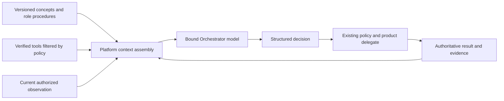

# SPEC-118: Orchestrator Knowledge and Collaboration Operations

## Metadata

| Field | Value |
|-------|-------|
| Status | In progress; K1 knowledge delivery fixture-validated; collaboration operations pending |
| Owner | Platform integration; Chat owns conversation operations |
| Reviewer | Product owner; independent implementation reviewer unassigned |
| Decision | [ADR-119](../decisions/119-share-product-knowledge-and-role-procedures-with-supervised-agents.md) |
| Plan | [PLAN-110](../plans/PLAN-110-orchestrator-knowledge-and-collaboration-rollout.md) |
| Last updated | 2026-09-24 |

## Summary

Give Orchestrator both compatible product procedures and the current verified
tool surface, with bounded user/context inputs and structured execution feedback.
Reuse the knowledge mechanism introduced for Catlas, while keeping Orchestrator
independent of the optional Guide Cat and preserving existing supervision.
Ordinary collaboration knowledge belongs in both release and preview/debug;
Cats-source development/practice skills remain governed by SPEC-117.

The owner calls this coordinator God Cat; current implementation prompts call
the visible role Boss Cat. This spec introduces no new Cat type or public rename.
The contracts below are proposed until their PLAN-110 gate has evidence.

## Goals

- Make product knowledge reusable across explanation and coordinated execution.
- Teach selection, sequencing, handoff and verification alongside tool schemas.
- Prove actual model input delivery without requiring provider-native skills.
- Enable one recoverable collaboration flow using canonical product operations.

## Non-Goals

- Enabling the preview development supplement in release.
- Giving Catlas orchestration authority or requiring it for ordinary Chat.
- Replacing deterministic routing, the interaction engine or Core work records.
- Autonomous source modification, practice, knowledge promotion or publication.
- A generic shell/HTTP escape hatch for missing product operations.
- Shipping a new MCP server, native skill library or vector database in phase 1.

## Inspected Baseline (before K1)

Static inspection on 2026-09-24 used Platform `1391075e`, including the Catlas
implementation and packaging correction in `0f140439` / `e3a61434`. This planning
pass did not run a provider, create real conversations or modify user state.

| Area | Existing source | Gap for this work package |
|------|-----------------|---------------------------|
| Knowledge | [reader](../../src/platform/catlas/knowledge.ts), [bundle](../../config/catlas-knowledge.json) | Code-entry Catlas only; no Orchestrator consumer or role/procedure selection |
| Visible coordinator | [prompt builder](../../src/products/chat/state/prompts.ts) | Fixed role/roster/memory/recent-message context; mentions existing participants, no versioned procedure delivery |
| Decision request | [Chat requester](../../src/products/chat/state/providerAgentDecisionRequester.ts), [Platform adapter](../../src/platform/orchestration/providerAgentAdapter.ts) | Structured decision contract exists; prompt serializes observation without product procedure content |
| Observation and capabilities | [Chat observation](../../src/products/chat/state/providerAgentObservation.ts), [turn preparation](../../src/products/chat/state/runtime-dispatch/turn.ts) | Bounded routing summaries and selected Work descriptors exist; no complete collaboration operation inventory |
| Conversation mutations | [Chat routes](../../src/products/chat/api/resources/channelRoutes.ts), [route support](../../src/products/chat/api/routeSupport.ts) | Existing product writes need explicit supervised agent adapters, receipts and retry/recovery mapping |
| Supervision | [policy gate](../../src/platform/orchestration/providerAgentPolicyGate.ts), [lifecycle tools](../../src/platform/supervision/lifecycleTools.ts) | Reusable primitives; a spawn record alone does not establish conversation membership or finished work |
| Registries | [tool calls](../tool-calls.md), [control surfaces](../agent-control-surfaces.md) | Several internal delegates still have pending runtime exposure; an HTTP route is not proof of agent callability |

## Design Overview

Catlas uses the same knowledge reader with its own scope and explain-only
inference path. The visible coordinator response and provider-agent decision
request can consume different selected procedures, but neither may infer that
content delivered to another session is already present in its own context.

### Knowledge and procedure contract

The shared reader must retain the current Catlas v1 behavior while introducing
an explicitly versioned role-aware format. Entry metadata is:

| Field group | Meaning |
|-------------|---------|
| Identity/provenance | Stable entry ID, revision, content digest, sources and verification date |
| Audience/kind | `catlas` and/or `orchestrator`; concept or procedure |
| Applicability | Product/build range, required capabilities, locale and supported surfaces |
| Selection | Intent/topic cues and bounded entry size |
| Procedure | Prerequisites, ordered steps, expected observations/results, recovery and stop conditions |
| Operation dependencies | Canonical operation IDs and compatible contract revisions; no copied executable schema |

Knowledge files contain product facts and methods. Actual Cat IDs, provider
readiness, grants, budgets and conversation contents belong in a fresh
observation, not a distributable bundle. Build-coupled files are authoritative;
indexes and native/MCP delivery representations are derived and replaceable.

### K1 implementation contract

The shared Platform reader accepts the shipped Catlas `schemaVersion: 1`
bundle and the new `schemaVersion: 2` Orchestrator bundle. V1 entries normalize
to `catlas` concepts on `code-help`; V2 explicitly validates `roles`, `kind`,
`surfaces` and `requiredOperations: [{ id, version }]`, as well as both `en` and
`zh-TW` contents. Operation dependencies require an exact manifest revision.
Bundle loading is capped at 128 KiB; the entire serialized Orchestrator knowledge
envelope, including goal, scope, operations, entries and digest, is at most
16,000 characters. Truncated goals/operations and omitted large scope summaries
are explicit; omitted scope retains a digest and suppresses intent procedures.

Chat selects on the actual bounded goal, response language, current roster,
surface and verified operation descriptors. Ordinary/global Orchestrator replies
receive inline per-turn instructions, including the rewrite pass; structured
decision requests receive the same content mechanism in their own JSON envelope.
Provider-selected default Chat retains its ordinary assistant identity. Code and
Work also reuse the internal actor slot; they retain product-owned instructions.
K1 coordinator role injection requires explicit Chat origin and a real
Orchestrator consumer. Other Cats do not inherit this role.

Decision requests compare the current normalized provider/model/instance/control
identity with the capability observation and send the actual Orchestrator binding,
including default-model selection and controls. This does not use Catlas's binding.
Each invocation reloads the packaged asset and recomputes context provenance;
there is no selection cache that survives a binding, locale, roster, policy or
tool change. Visible dispatch conservatively exposes only the existing room
handoff convention; a requested tool-intent profile is not a verified provider
tool inventory. Decision selection uses its policy-filtered `availableTools`.

`productKnowledge` request metadata records status, role/surface/locale, bundle
revision/digest, entry IDs/revisions/digests, context digest and `inline`/`none`
delivery. Visible assistant metadata retains the receipt after Runtime returns.
The existing request/session evidence identifies the execution target. These
receipts prove what the request contained, not model understanding or completed
product operations. Missing/invalid/incompatible content produces an empty
snapshot and normal dispatch under existing policy. Native skill discovery is
not required; new collaboration tools and their result loop remain K2/K3 work.

### Candidate collaboration operations

The following are semantic responsibilities, not registered tool names or new
public endpoints. Final identifiers/schemas come from their owning delegates
and are registered only when the complete call/result path is implemented.

| Operation | Input supplied by model | Server-resolved context and result |
|-----------|-------------------------|------------------------------------|
| Discover eligible teammates | Required role/capability, bounded query | Authorized existing Cats, stable IDs, readiness/availability and capability limits |
| Inspect collaboration context | Authorized conversation reference | Current participants, supported topology, work state and observed revision |
| Prepare or ensure conversation | Goal, product origin, reuse/create intent, selected eligible participants | Validated scope, creation identity, canonical conversation/channel mapping and created/reused outcome |
| Ensure participant membership | Existing Cat reference and intended role | Allowed conversation, current membership, added/already-present outcome |
| Assign and start work | Bounded task, target, context references and dependency | Existing Task/Run owner, admitted budget, accepted/started/rejected outcome and runtime references |
| Inspect or stop owned work | Operation/run reference | Authoritative lifecycle, cancellation outcome, retained work/evidence references |

The first flow uses two distinct existing, eligible Cats for implementation and
review. It does not create permanent Cats or provider instances. Review starts
after the implementation artifact/revision is available. Adding a participant,
starting a run and completing a task are separately observable outcomes.

## Requirements

### Functional Requirements

- **FR-01 — Shared ownership.** Platform shall own validated knowledge loading,
  applicability, bounded selection and provenance. Catlas and Orchestrator shall
  use this mechanism without depending on each other's identity or settings.
- **FR-02 — Versioned role procedures.** Validate the entry metadata above,
  reject unsupported formats, select only applicable role/surface content and
  preserve tested behavior for the shipped Catlas v1 bundle. Limit loaded bytes
  and model context; do not load every procedure on every turn.
- **FR-03 — Tool truth.** Derive available operations from executable manifests,
  verified adapters, selected provider capability and current policy. Procedures
  cannot register tools. Missing/incompatible required operations prevent an
  execution procedure from being presented as runnable.
- **FR-04 — Actual model delivery.** Deliver relevant content to the visible
  coordinator and the decision path that performs the task. Phase 1 uses inline
  content. A later native-skill or MCP resource path must prove the actual read
  and preserve the same entry revision/digest; a path or URI is not delivery.
- **FR-05 — Bounded current context.** Provide the actual authorized user goal,
  surface, entity references, eligible roster, availability, grant/budget summary
  and observation revision. Existing character counts and opaque references
  alone are insufficient for a new collaboration decision. Revalidate facts at
  mutation time. Exclude unrelated private conversations and secrets.
- **FR-06 — Role and routing integrity.** Resolve the Orchestrator's own binding
  and server-owned actor identity. Knowledge must not override deterministic
  routing, add implicit audience members, turn a mention into an invitation or
  grant a procedure/tool access from its text.
- **FR-07 — Complete operation path.** Reuse owning product delegates and the
  supervised tool boundary for each advertised operation. Validate target scope,
  schema, current state, capability, authorization and existing approval rules.
  Preserve conversation topology, origin/recents and publication of product state
  changes. Never write raw Core/channel records from a skill.
- **FR-08 — Feedback and verification.** Return structured results to the same
  coordinating run and expose relevant postconditions. Distinguish rejected,
  pending approval, accepted, started, completed and failed states. Report creation
  only after reading its canonical identity/membership; report task success only
  after the expected output is verified.
- **FR-09 — Durable retry and cancellation.** Bind operation identity to the
  admitted user intent/run. Repeated or concurrent delivery shall not duplicate
  conversations, memberships or work. Changed inputs using the same identity
  shall conflict. Reconcile interrupted/partially applied work before retrying;
  cancellation stops owned execution and retains already created work/evidence.
- **FR-10 — Scoped handoff and review.** Transfer the goal, allowed resources,
  constraints, expected output and source-run references to each selected Cat.
  Use a distinct eligible reviewer for the first flow and pass the actual
  implementation result before review. If that is impossible, explain the unmet
  prerequisite rather than inventing a teammate or claiming independent review.
- **FR-11 — Traceable delivery.** Record requested/selected/delivered entry IDs,
  revisions/digests, delivery mode, target/session, input-context revision and
  operation/result references through existing trace/evidence ownership. Do not
  require hidden reasoning traces or a second private conversation ledger.
- **FR-12 — Invalidation and fallback.** Refresh selection on build, tool,
  provider binding, role, grant or relevant state changes, including resume.
  Missing knowledge preserves ordinary Chat and existing routing; the new
  collaboration workflow stops or requests a missing prerequisite without
  fabricating success, broadening permissions or retrying without a bound.
- **FR-13 — Distribution.** Package normal product procedures for source-free
  release and preview/debug. Keep ADR-118's development/practice supplement
  separate. A native wrapper, if introduced later, is an explicitly classified
  Runtime-delivered representation, not a new Platform skill catalog.
- **FR-14 — Compatibility and learning.** Preserve compatible 0.4.x interfaces
  for additive wiring. Any breaking contract follows the next-minor policy.
  User-data changes need validated backup, atomic replacement and failure/restart
  recovery tests. Candidate lessons follow SPEC-117's independent promotion;
  ordinary conversations are not automatically global training material.

### Non-Functional Requirements

- Reuse current bounded context limits as the starting budget and record any
  justified increase; no unbounded tool/resource discovery or full-state dump.
- Use existing execution budgets and cancellation, with explicit limits for
  operation count, elapsed time and measured provider usage in the first flow.
- Begin with English and Traditional Chinese; validity and execution semantics
  must not depend on which natural language expresses the goal.
- Missing procedure knowledge must not break ordinary conversation delivery.

## First End-to-End Acceptance Scenario

Request: "Create a bug-fix conversation with one implementer and one reviewer."

1. Resolve the current goal, authorized scope and two eligible existing Cats.
   Ask a focused question if the bug or intended workspace is unspecified.
2. Reuse a suitable authorized conversation when requested, or create one with
   the correct origin/topology and durable operation identity.
3. Ensure membership and roles once, then read back canonical participant IDs.
4. Create/assign work through its owning product path and start the implementer
   with bounded context. Review depends on the returned artifact/revision.
5. Return each actual tool result to the Orchestrator. Rejected, pending or
   partial results select the documented recovery instead of a success claim.
6. Report the conversation, participants and work status with evidence. Retry
   the same intent and prove there are no duplicate resources.

A candidate conversation being created does not mean the bug is fixed. A review
assignment is not a completed review. The first knowledge-only gate cannot be
reported as this end-to-end scenario passing.

## Acceptance Criteria

K1 has fixture evidence for AC-01/AC-02 and the knowledge-only parts of
AC-03/AC-08/AC-09, recorded in PLAN-110. Real provider/native behavior, new
collaboration operations, full profile exclusion and end-to-end acceptance
remain pending; the criteria below describe the full target.

| ID | Observable criterion | Requirements |
|----|----------------------|--------------|
| AC-01 | Shared reader selects role/locale/build-compatible content and rejects invalid/oversized bundles while existing Catlas fixtures continue to pass | FR-01, FR-02, FR-14 |
| AC-02 | Captured requests contain actual selected procedure text/digests in both applicable Orchestrator paths, including a provider without native skill support | FR-04, FR-11 |
| AC-03 | An unsupported tool or stale tool revision cannot become callable through a procedure; ordinary Chat still works | FR-03, FR-06, FR-12 |
| AC-04 | Two different authorized goals/states produce distinguishable observations and appropriate eligible targets; unrelated private data is absent | FR-05, FR-06, FR-10 |
| AC-05 | The collaboration scenario reads back canonical conversation/membership IDs and correct product projections | FR-07, FR-08 |
| AC-06 | The same, concurrent and interrupted intents do not duplicate resources; changed inputs conflict and cancellation preserves recoverable outputs | FR-09, FR-14 |
| AC-07 | Rejected/pending/failed tool results reach the coordinating model and prevent false creation/start/completion reports; review uses the real implementation result | FR-08, FR-10, FR-11 |
| AC-08 | Binding, permission, tool, build and resume changes invalidate stale procedure selection and observations | FR-02, FR-05, FR-12 |
| AC-09 | Source-free npm/Desktop fixtures include normal procedures and consume them without Catlas or development skills; profile exclusion is separately evidenced | FR-01, FR-13 |
| AC-10 | An isolated live-provider candidate performs the flow with an identified grant/budget and evidence; knowledge promotion and persistent-state upgrade checks apply before their respective gates close | FR-07, FR-09, FR-11, FR-14 |

## Dependencies and Implementation Decisions

The integration owner must map durable operation identity/recovery fields onto
existing Core/Work records before enabling writes. Final operation schemas,
approval UX and topology mapping require owning-product review; they are not
new public contracts in this drafting pass. Changes to frozen Core/Chat contracts
must follow the [integration guide](../product-integration-guide.md).

Native skill/MCP resource delivery is deferred until inline delivery and the
first complete tool/result path are validated. Runtime changes, if required,
must have their own member-local implementation and compatibility checks.

## References

- [SPEC-117: knowledge production and promotion](SPEC-117-cats-self-development-and-catlas-practice.md)
- [SPEC-109: phase-scoped tools](SPEC-109-phase-scoped-work-tool-surface.md)
- [PLAN-075: provider-agent supervision](../plans/PLAN-075-real-provider-orchestrator-integration.md)
- [Tool registry](../tool-calls.md) and [control surfaces](../agent-control-surfaces.md)

---

*Created: 2026-09-24*
*Last updated: 2026-09-24*
